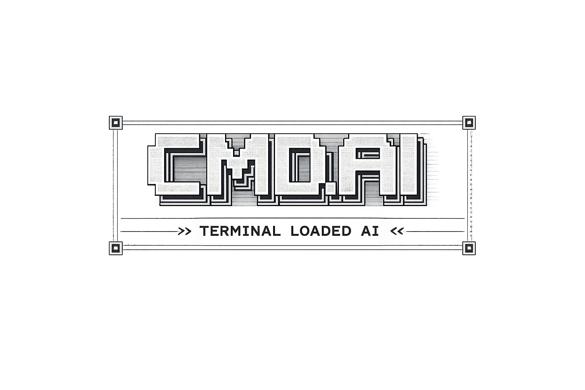

---

A local terminal AI assistant based on GGUF and llama‑cpp‑python models.
No cloud. Complete privacy.

## 🎥 Demo

## ⚙️ Functions

The application runs completely offline, using only local GGUF models, ensuring complete privacy and no internet dependency. It allows for conversations in the terminal. It supports downloading models from the `models` file, automatic model loading, generating responses, and much more. It has a built-in lightweight HTTP server that provides an API for communicating with the model in other applications.

## 🔧 Instructions

### Quick Start

1. Python 3.11+ required.
2. Install a GGUF model and copy it to models/.
3. Run the application:
`py -3 run.py`
4. Load the model:
`load <filename.gguf>`
5. Talk to the model:
`ai`
or:
`chat <text>`

### CLI commands

- `load` - choose model from list
- `load <name>` - load model by filename
- `models` - list local GGUF models
- `catalog` - list downloadable aliases
- `download <alias|url> [file.gguf]` - download model
- `pull <alias|url> [file.gguf]` - alias for `download`
- `ai` - chat mode (`AI>`)
- `chat <text>` - single message
- `unload` - unload model from RAM
- `status` - app status
- `version` - `llama-cpp-python` version
- `update` - runtime update

### SERVER (localhost:8080)

- `GET /tags`
- `POST /generate`
- `POST /chat`
- `POST /pull`
- `GET /version`

---

## How to Help with CMDAI

Thank you for your interest in improving CMDAI!
Here are simple ways you can support the project.

### Ways You Can Help

- Report bugs in the **Issues** tab
- Suggest new features
- Test the application on your system
- Share improvement ideas
- Add and test new GGUF models

### How to Submit an Issue

1. Go to the **Issues** tab
2. Click **New Issue**
3. Choose: Bug / Feature / Idea
4. Describe the problem or suggestion clearly

### OR

1.Go to Discussions. 
2.write your suggestions in the How To Help category.

Every contribution is appreciated!

---

## Notes:

- `models/` and large local binaries are excluded from the repository by `.gitignore`.
- This project is designed to run fully local models.
- The application can only work with the `models/` file and the `run.py` file

---

## ⭐ Inspirations

This project was inspired by tools like **Ollama** and **LM Studio**, which showed how powerful and accessible local AI models can be.  
I wanted to bring a similar experience directly into the command line — simple, fast, and fully local — without the need for heavy interfaces or external services.  
CMD LOCAL AI is my attempt to create a clean, terminal‑native way to interact with AI models.

---

## 🚀 Future Ideas

CMD LOCAL AI is a project being developed step by step. Below are the directions I plan to develop in future versions:

- **Support for multiple models simultaneously** - switching between local models without restarting the application.
- **Performance profiling** - real-time viewing of generation time and RAM and CPU usage.
- **Developer Tools mode** - viewing system prompts, tokens, and raw model responses.
- **Integration with plugins/extensions** - the ability to add custom commands and actions performed by the AI.
- **Support for audio and vision models** - speech and image support for compatible local models.
  
---

### 🤗 THANKS FOR READING :)

